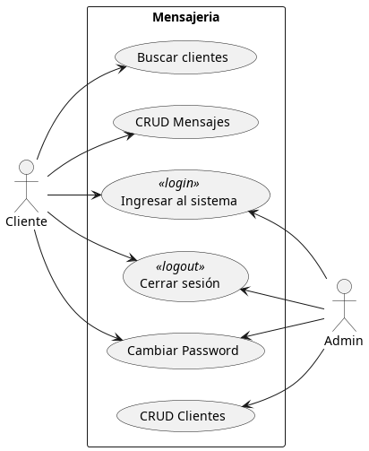
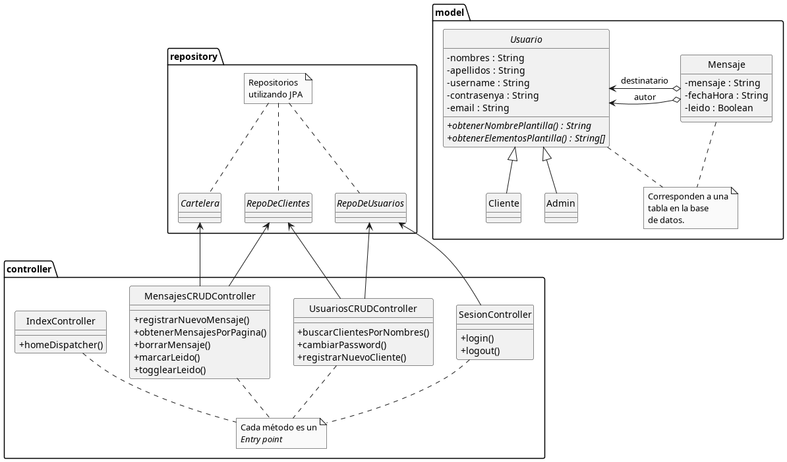

# Sistema de mensajería con Spring Boot

## Objetivos del sistema

### Funcional

Este modela un sistema de intercambio de mensajes entre clientes. Debe entenderse cono un intercambio de memos o posits que serían dejadas en el escritorio de un compañero.

En éste existe un administrador y los clientes, cuyas interacciones con el sistema están modeladas en el siguiente diagrama UML de Casos-uso.

### Pedagógico

Se despligan diferentes recursos en la utilización básica de Spring Boot y frameworks asociados (SpringMVC, Hibernate, etc.) que pueden ser utilizados para acelerar y desacoplar el sistema de forma eficiente. En el siguiente diagrama UML de Clases observamos este desacople en acción

